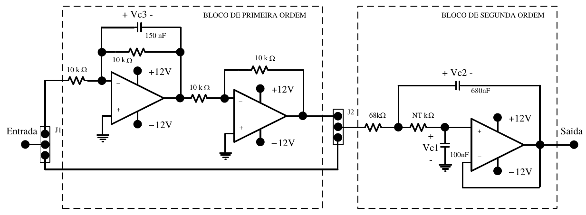

# Projeto de um sistema de controle representado por variáveis de estados

Este projeto tem por objetivo modelar um controlador utilizando variáveis de estados de uma planta conhecida com um observador de ordem mínima. Buscando reduzir o tempo de acomodação e o sobre-sinal pela metade do seus respectivos valores. O circuito proposto é apresentado na figura 1.

Figura 1. Circuito proposto.

O arquivo [modelagem_parametros.m](modelagem_parametros.m) apresenta uma planilha de cálculo para a obtenção dos parâmetros. 

A pasta [STM32F103](./STM32F103) possui os arquivos do projeto do microcontrolador (um STM32F103), onde foi utilizado o software STMCube para a configuração do mesmo. 
